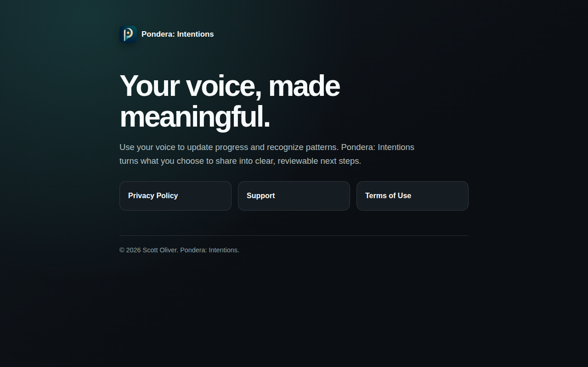
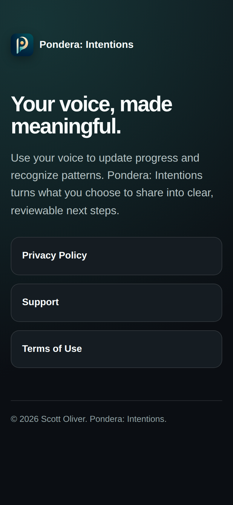
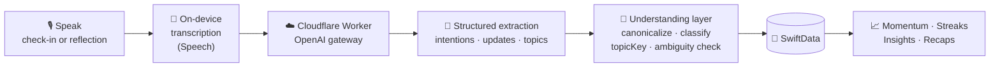
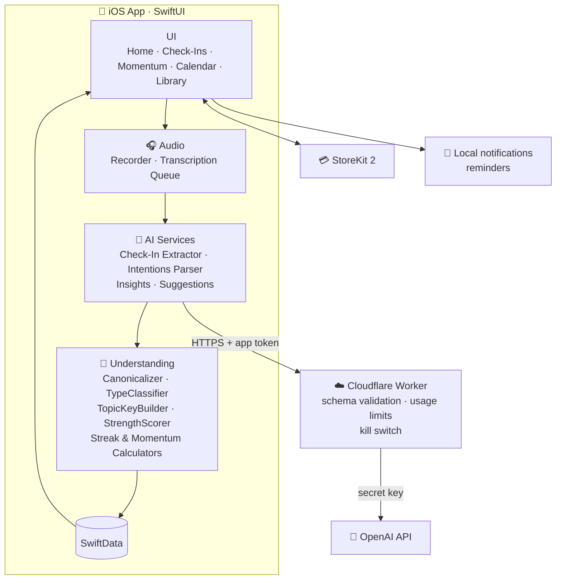

<div align="center">

# 🎙️ Pondera: Intentions

**Your voice, made meaningful.**

An iOS app for voice-first reflection. Speak your intentions and daily check-ins, and Pondera turns what you share into clear, reviewable progress, patterns and next steps.


</div>

---

## 📱 Screenshots

| Home / Today's Progress | Voice Check-In | Talk It Out | Momentum |
|:---:|:---:|:---:|:---:|
| _screenshot coming soon_ | _screenshot coming soon_ | _screenshot coming soon_ | _screenshot coming soon_ |

<!-- Replace the placeholders above with images, e.g.  -->

### Website

The support, privacy and terms site (`Pondera-website-upload/`) is static HTML.

<p align="center">
  
  &nbsp;
  
</p>

---

## ✨ Features

- **Voice intentions.** Say what you want to work on, and Pondera parses it into structured intentions such as fitness, nutrition, focus or habits.
- **Voice check-ins.** A quick spoken update gets transcribed and matched to your intentions to log progress automatically.
- **Talk it out (Listening Sessions).** Longer, free-form reflections get pulled apart into topics, progress updates and suggested next steps.
- **Momentum and streaks.** Weekly momentum bars, a streak counter, progress scoring and a calendar view.
- **Insights and patterns.** Recurring topics are grouped under deterministic topic keys, so trends stay consistent over time.
- **Privacy-minded AI.** The OpenAI key never ships in the app. All AI calls go through a Cloudflare Worker gateway, and the app shows an AI disclosure before first use.
- **Subscriptions.** StoreKit 2 handles in-app purchases, with AI usage limits for each tier.

---

## 🧠 How voice becomes progress



## 🏗️ Architecture



### Why the proxy?

`backend/openai-proxy` is a small TypeScript Cloudflare Worker that:

- Keeps `OPENAI_API_KEY` off the device, and lets the key rotate without a new App Store build
- Validates the model, message and schema shapes before forwarding anything
- Has an `AI_ENABLED=false` emergency kill switch
- Is tested with mocked OpenAI responses, so tests never spend API credits

---

## 🧰 Tech Stack

| Layer | Tech |
|---|---|
| App | Swift, SwiftUI, SwiftData, Speech, AVFoundation, StoreKit 2, UserNotifications |
| AI | OpenAI chat completions with structured JSON schemas |
| Backend | Cloudflare Workers (TypeScript), Wrangler, Vitest |
| Web | Static HTML/CSS |

## 📂 Repo Layout

```
Pondera/                   Xcode project
  Pondera/
    AI/                    OpenAI client + extraction services
    Audio/                 Recording & transcription pipeline
    Understanding/         Deterministic normalization, scoring & streaks
    UI/                    SwiftUI screens
    Models/  Storage/
backend/openai-proxy/      Cloudflare Worker AI gateway
Pondera-website-upload/    Support, privacy & terms site
APP_STORE_RELEASE_GUIDES/  Release & resubmission playbooks
```

---

<div align="center">

Built by **[Scott Oliver](https://github.com/scootero)**

</div>
